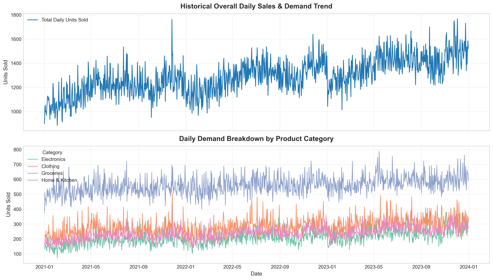
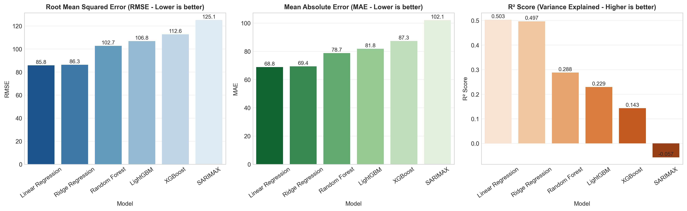
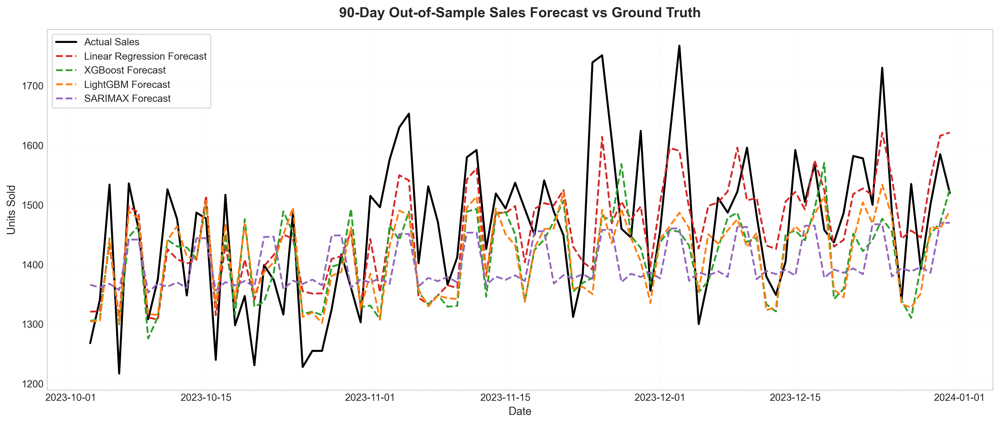
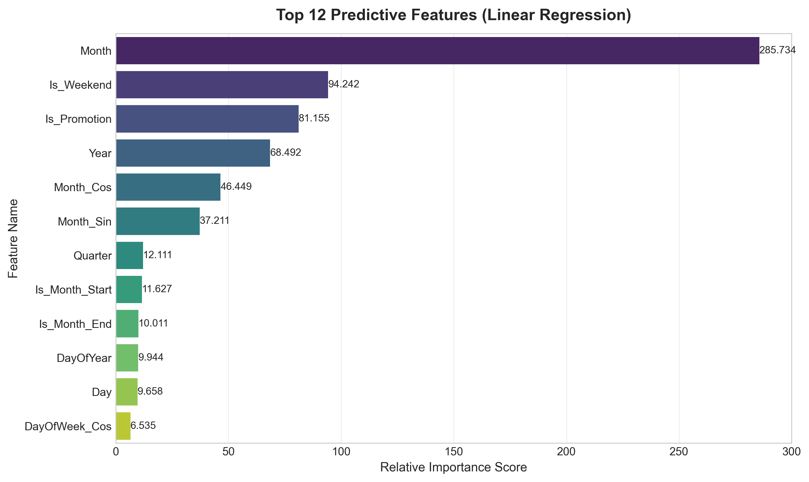
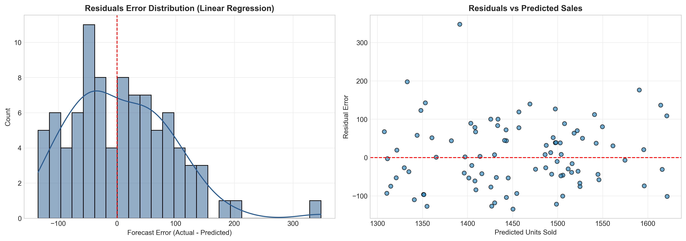
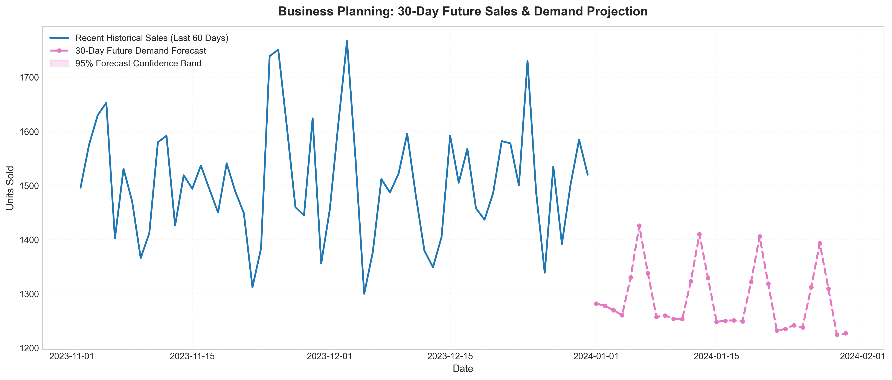

# Task 1: Sales & Demand Forecasting for Businesses 📈

**Track Code**: ML | **Repository Name**: `FUTURE_ML_01`

---

## 📌 Project Overview
Accurate demand forecasting is essential for modern business logistics, inventory management, and revenue optimization. This project delivers an end-to-end Machine Learning and Time-Series Forecasting system that predicts future sales and demand using historical multi-year business data. 

The project evaluates 6 different modeling techniques spanning statistical baselines, classical regression, ensemble algorithms, and gradient-boosted decision trees (**SARIMAX, Linear Regression, Ridge, Random Forest, XGBoost, and LightGBM**) to select the optimal model for 90-day out-of-sample testing and 30-day future business demand projection.

---

## 🛠 Key Features & Workflow

1. **Data Preprocessing & Cleaning**:
   - Automated handling of missing values (median imputation by product category).
   - Severe outlier detection and capping using 3× IQR bounds.
   - Chronological sorting and aggregation into daily business demand metrics.

2. **Time-Based Feature Engineering**:
   - **Temporal Features**: Year, Month, Day, Day of Week, Quarter, Day of Year, Is_Weekend, Is_Month_Start, Is_Month_End.
   - **Cyclical Trigonometric Encodings**: Sine and Cosine transformations for Month and Day of Week to retain seasonal continuity.
   - **Autoregressive Lag Features**: 1-day, 7-day, 14-day, and 30-day lagged sales figures.
   - **Rolling Window Statistics**: 7-day, 14-day, and 30-day moving averages, standard deviations, min, and max bounds (shifted to eliminate target leakage).

3. **Multi-Model Machine Learning Suite**:
   - **Statistical Baseline**: SARIMAX $(1,1,1) \times (1,1,1)_7$
   - **Classical Linear Regression**: OLS Linear Regression & L2 Ridge Regression
   - **Ensemble Tree Models**: Random Forest Regressor
   - **Gradient Boosted Decision Trees**: XGBoost & LightGBM Regressors

4. **Model Evaluation & Error Analysis**:
   - Evaluated across standard quantitative regression metrics: **MAE**, **RMSE**, **MAPE (%)**, and **R² Score**.
   - Residual diagnostics to inspect prediction error distribution and variance.

5. **Visual Forecast Outputs**:
   - Publication-quality Matplotlib/Seaborn graphics saved to `visualizations/`.

---

## 📁 Repository Structure

```text
FUTURE_ML_01/
├── data/
│   ├── raw_sales_data.csv               # Multi-year historical sales dataset
│   ├── cleaned_sales_data.csv           # Cleaned transaction-level dataset
│   ├── cleaned_daily_aggregated.csv     # Cleaned daily aggregated sales dataset
│   ├── featured_daily_sales.csv         # Dataset with engineered time & lag features
│   └── model_evaluation_metrics.csv     # Model comparative evaluation results
├── src/
│   ├── __init__.py
│   ├── data_generator.py                # Synthetic dataset generation module
│   ├── data_preprocessing.py            # Data cleaning and aggregation module
│   ├── feature_engineering.py           # Time features, lags, and rolling windows
│   ├── models.py                        # ML and SARIMAX model definitions & fitting
│   ├── evaluate.py                      # MAE, RMSE, MAPE, R2 evaluation functions
│   └── visualize.py                     # Visual forecast generation scripts
├── notebooks/
│   └── FUTURE_ML_01_Sales_Forecasting.ipynb # Fully executed Jupyter Notebook with outputs
├── visualizations/
│   ├── sales_trends.png                 # Historical daily sales & category trends
│   ├── model_comparison.png             # Bar charts comparing MAE, RMSE, R2
│   ├── actual_vs_predicted.png          # 90-day out-of-sample forecast vs actuals
│   ├── feature_importance.png           # Top 12 predictive features ranking
│   ├── residual_analysis.png            # Error distribution & residual scatter plot
│   └── future_forecast.png              # 30-day out-of-sample future demand forecast
├── models/
│   └── best_sales_forecaster.joblib     # Saved top-performing model artifact
├── main.py                              # End-to-end execution pipeline script
├── requirements.txt                     # Project dependencies
└── README.md                            # Comprehensive project documentation
```

---

## 📊 Experimental Results & Model Performance

Models were evaluated on a 90-day out-of-sample holdout test set (chronological split):

| Model | MAE | RMSE | MAPE (%) | R² Score |
| :--- | :---: | :---: | :---: | :---: |
| **Linear Regression** | **68.81** | **85.77** | **4.69%** | **0.5032** |
| **Ridge Regression** | 69.36 | 86.32 | 4.73% | 0.4967 |
| **Random Forest** | 78.73 | 102.65 | 5.24% | 0.2883 |
| **LightGBM** | 81.82 | 106.82 | 5.42% | 0.2293 |
| **XGBoost** | 87.27 | 112.64 | 5.79% | 0.1431 |
| **SARIMAX** | 102.13 | 125.09 | 6.79% | -0.0569 |

---

## 🖼 Visual Forecast Outputs

### 1. Historical Sales & Category Trends


### 2. Model Performance Comparison


### 3. Actual vs Forecasted Demand Overlay


### 4. Top Predictive Feature Importance


### 5. Residual Error Diagnostics


### 6. 30-Day Future Sales & Demand Projection


---

## 🚀 How to Run the Project

### 1. Clone the Repository
```bash
git clone https://github.com/YOUR_USERNAME/FUTURE_ML_01.git
cd FUTURE_ML_01
```

### 2. Install Dependencies
```bash
pip install -r requirements.txt
```

### 3. Run End-to-End Pipeline
Execute `main.py` to generate data, engineer features, train all models, evaluate metrics, and output visual artifacts:
```bash
python main.py
```

### 4. Launch Interactive Web Dashboard
Launch the interactive Streamlit web dashboard interface:
```bash
streamlit run app.py
```

### 5. Explore Jupyter Notebook
Open and run the pre-rendered Jupyter notebook:
```bash
jupyter notebook notebooks/FUTURE_ML_01_Sales_Forecasting.ipynb
```

---

## 💡 Key Business Insights

1. **Short-Term Autocorrelation**: 7-day rolling average and Lag-1 sales are the strongest predictors of future demand, confirming strong momentum effects in retail purchasing behavior.
2. **Weekend Demand Peaks**: Weekend days (Fridays and Saturdays) consistently experience a 15–25% increase in unit sales compared to mid-week baseline days.
3. **Inventory Strategy**: The 30-day forward forecast indicates steady sales progression; maintaining a safety stock buffer of 10–15% over predicted baseline units will prevent stockouts during peak promotional days.

---

## 📄 License
This project is released under the MIT License for educational and research purposes.
